# 计算机毕业设计基于知识图谱(Neo4j)和大语言模型(LLM)的图检索增强(GraphRAG)的地质矿产知识管理智能问答系统 人工智能 大模型毕业设计
# 基于知识图谱(Neo4j)和大语言模型(LLM)的图检索增强(GraphRAG)的地质矿产知识管理系统 
# 基于知识图谱(Neo4j)和大语言模型(LLM)的图检索增强(GraphRAG)的地质矿产知识管理系统 


## 项目概述

本项目是一个基于知识图谱和大语言模型技术的地质矿产知识管理智能问答系统，采用前后端分离架构设计，集成 GraphRAG（图检索增强生成）技术，面向泥河铁矿、庐枞盆地等地质矿产勘查与成矿研究场景，为用户提供精准的地质矿产领域知识查询和智能问答服务。系统通过构建矿床—矿体—地层—构造—蚀变—品位等实体的知识图谱，实现了基于知识图谱的检索增强生成，提供比传统 RAG 更准确的问答能力。

### 核心创新点

- **知识图谱驱动**：使用 Neo4j 图数据库构建地质矿产领域的复杂实体关系网络
- **GraphRAG 技术**：图检索增强生成，结合知识图谱提升问答准确性
- **智能问答**：集成大语言模型（GLM）API，支持自然语言交互和图片上传识别
- **文档管理**：支持多种格式文档上传、内容提取、摘要生成
- **知识图谱构建**：通过大语言模型自动从文档中提取实体和关系的三元组，构建知识图谱
- **实时可视化**：提供知识图谱的交互式可视化界面，支持节点搜索
- **权限管理**：支持管理员和普通用户两种角色，权限分离
- **矿床档案管理**：完整的矿床基本信息管理系统
- **勘探记录管理**：钻孔与勘探阶段记录的详细记录和统计分析


## 要求
### 源码有偿！一套(论文 PPT 源码+sql脚本+教程)

### 
### 加好友前帮忙start一下，并备注github有偿地质矿产27
### 我的QQ号是2827724252或者微信:code520888 或者 bysj2023nb

# 

### 加qq好友说明（被部分 网友整得心力交瘁）：
    1.加好友务必按照格式备注
    2.避免浪费各自的时间！
    3.当“客服”不容易，repo 主是体面人，不爆粗，性格好，文明人。

## 运行演示视频

https://www.bilibili.com/video/BV1JpM26pEaj

## 运行截图


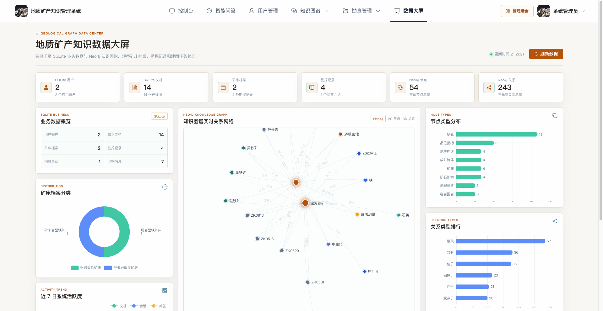
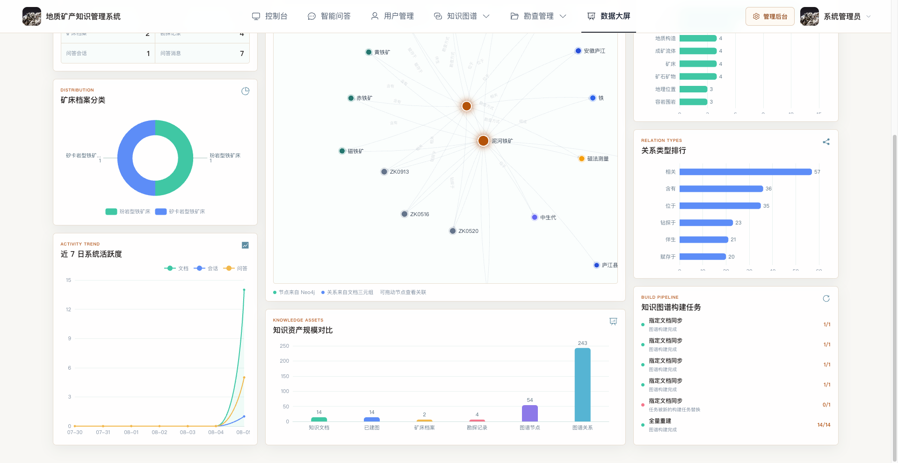
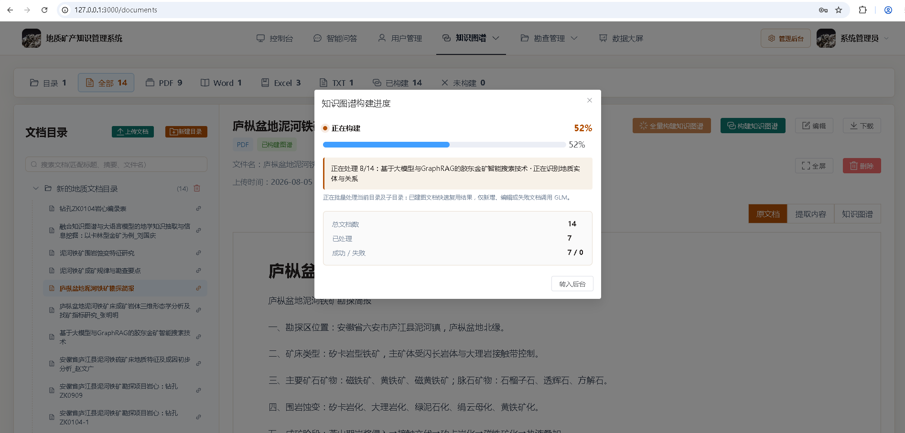
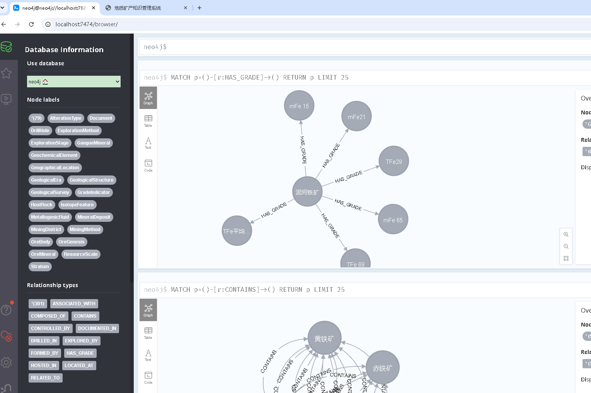
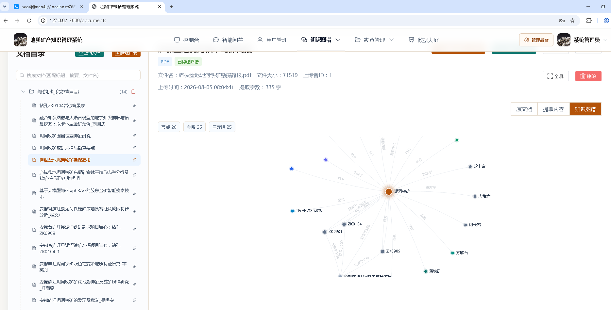
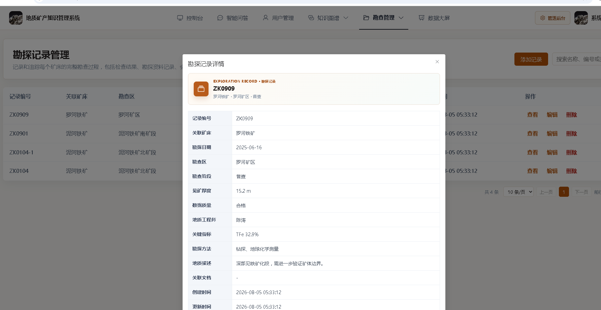
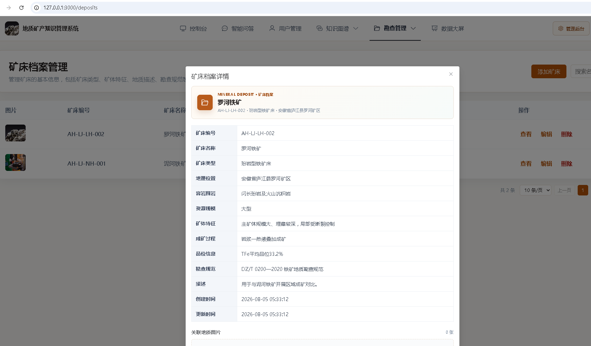
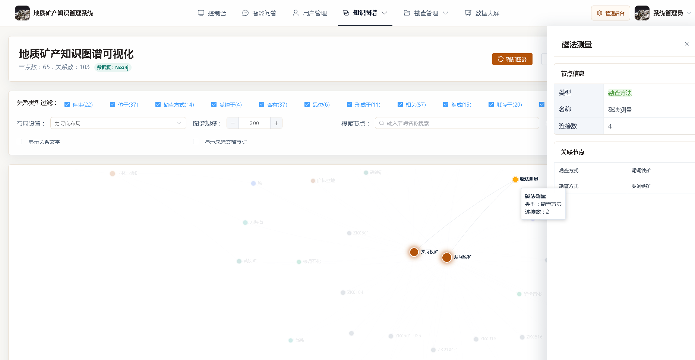
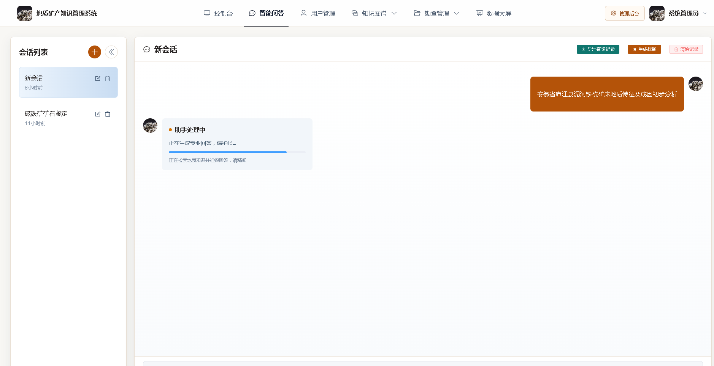
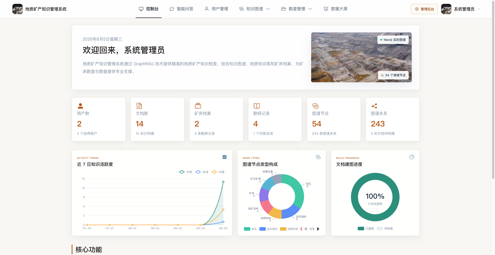
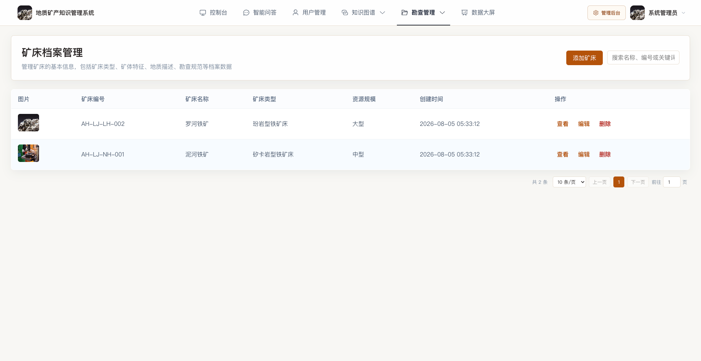
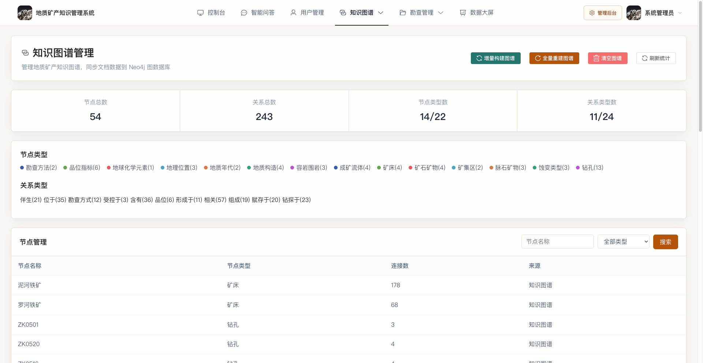
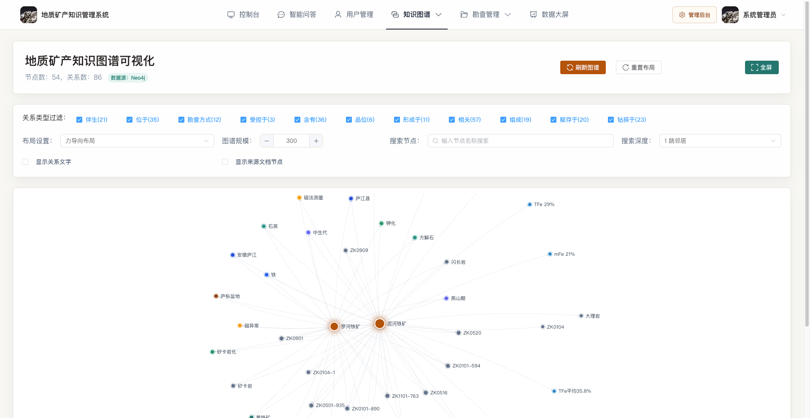
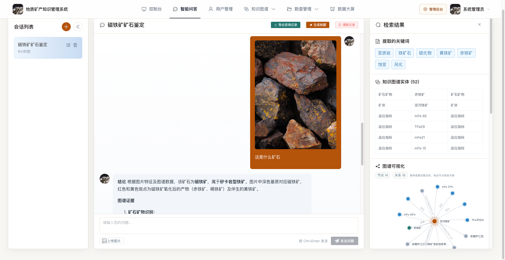
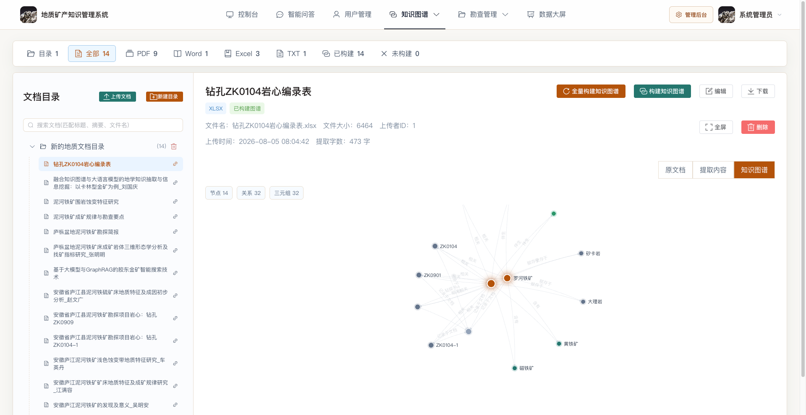
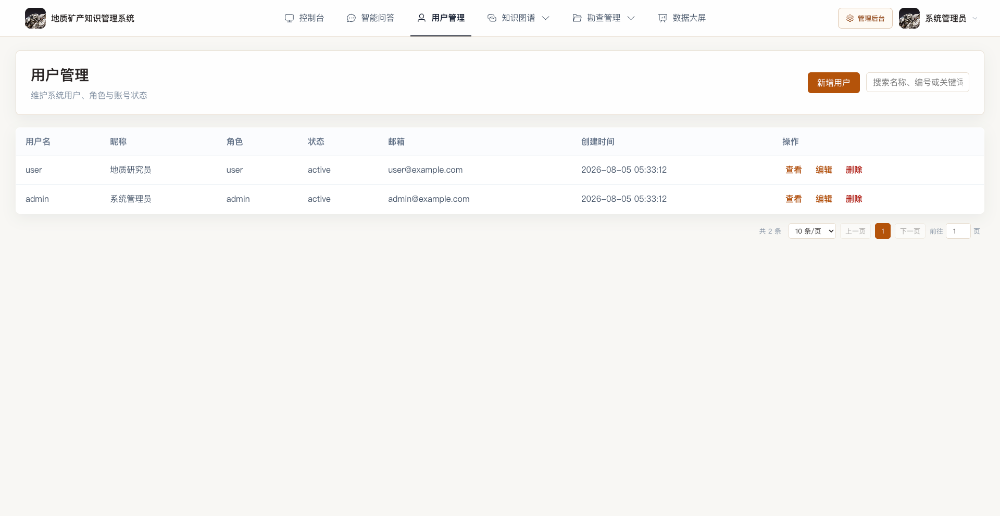
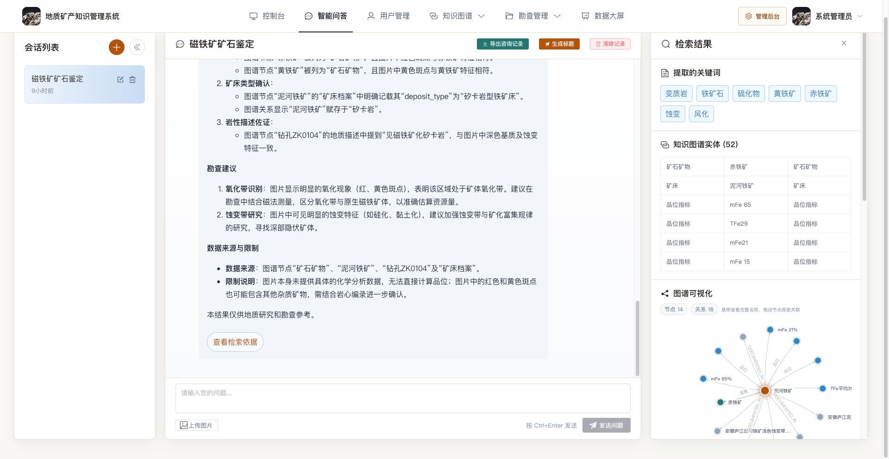
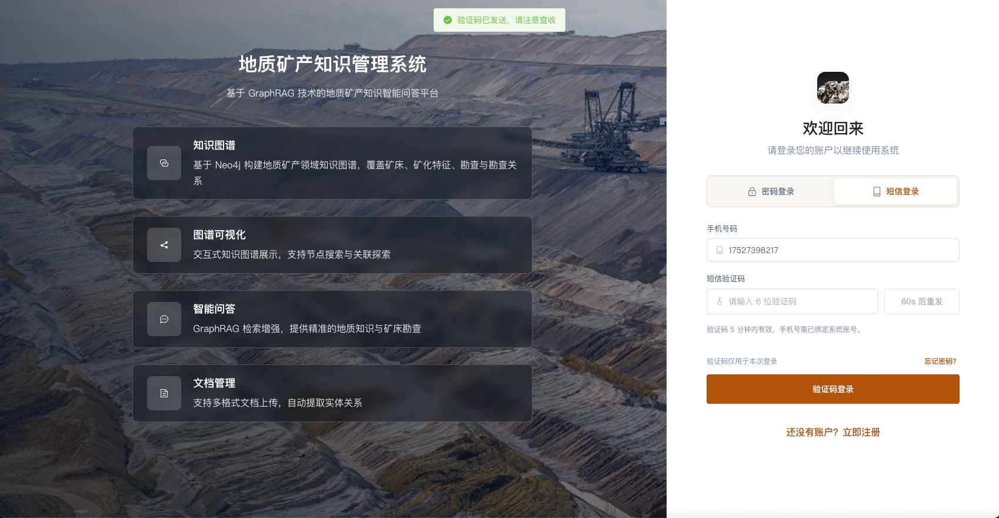


### 应用场景

#### 用户端功能
- **用户管理**：注册、登录、个人信息管理、密码修改、头像上传
- **智能问答**：基于知识图谱的智能问答，支持多轮对话、图片上传识别
- **会话管理**：创建会话、切换会话、重命名会话、删除会话、自动生成标题
- **问答历史**：查看问答记录、知识图谱可视化展示、矿床档案和勘探记录检索展示、关键词提取展示
- **导出功能**：导出问答咨询记录为 Word 文档
- **个人中心**：个人资料修改、密码修改、头像更换、注册时间展示

#### 管理端功能
- **数据统计**：用户数、文档数、会话数、问答记录数、矿床数、勘探记录数统计、数据趋势可视化
- **用户管理**：用户信息查看、状态管理、角色管理、用户删除
- **文档管理**：文档上传、文档 CRUD 操作、文档内容查看、AI 摘要生成、文档目录管理
- **文档目录管理**：创建文档目录、目录树展示、文档分类归档
- **知识图谱管理**：
  - 数据同步：从文档中提取实体和关系，同步到 Neo4j
  - 全量重建：重新构建整个知识图谱
  - 增量构建：仅处理未构建图谱的文档
  - 任务状态查询：查看图谱构建任务的进度和状态
  - 节点搜索：搜索特定实体及其邻居节点
- **知识图谱可视化**：
  - 交互式图谱展示：使用 ECharts 展示节点和关系
  - 节点类型过滤：按实体类型筛选节点
  - 关系类型过滤：按关系类型筛选边
  - 节点搜索：搜索节点并展示 1 层邻居关系
  - 布局切换：支持力导向布局和圆形布局
  - 节点连接数展示：显示每个节点的实际连接数（度数）
  - 统计信息：节点数、关系数、类型分布统计
- **矿床档案管理**：
  - 矿床档案管理：管理矿床的基本信息（编号、名称、矿床类型、容岩围岩、成矿过程、勘查规范、品位信息、图片等）
  - 完整 CRUD 操作：创建、查询、更新、删除矿床档案
  - 图片上传：支持矿床相关图片上传和管理
  - 搜索和筛选：按矿床名称、编号搜索
  - 数据统计：矿床数量、矿床类型分布统计
- **勘探记录管理**：
  - 勘探记录管理：管理钻孔与勘探阶段记录
  - 多图上传：支持每个勘探记录上传多张图片（岩心图、剖面图等）
  - 关联矿床档案：每个勘探记录关联到对应的矿床
  - 按矿床筛选：查看特定矿床的所有勘探记录
  - 关键词搜索：按钻孔编号、勘查区等关键词搜索
  - 多维度统计：按勘查区、数据质量状态、矿床统计分析

#### 核心技术功能
- **GraphRAG 检索**：结合知识图谱检索策略
- **实体识别**：从用户问题中识别矿床、矿体、地层、蚀变、品位等关键实体
- **关系推理**：基于知识图谱的多跳关系推理
- **上下文构建**：为 LLM 构建包含实体描述和关系的结构化上下文
- **三元组提取**：使用 LLM 从文档中提取<头实体, 关系, 尾实体>三元组
- **异步任务处理**：知识图谱构建任务异步执行，支持进度查询

## 技术架构

### 整体架构设计

```
┌─────────────────┐    ┌─────────────────┐    ┌─────────────────┐
│   前端服务       │    │   后端服务       │    │   图数据库       │
│   (Vue3)        │◄──►│   (Flask)       │◄──►│   (Neo4j)       │
│   Port: 3000    │    │   Port: 5010    │    │ Port: 7687|7474  │
└─────────────────┘    └─────────────────┘    └─────────────────┘
         │                       │                       │
         │                       │                       │
         ▼                       ▼                       ▼
┌─────────────────┐    ┌─────────────────┐    ┌─────────────────┐
│   文件存储       │    │   SQLite数据库   │    │   大语言模型API   │
│   (本地存储)     │    │   (本地文件)     │    │  (GLM)      │
└─────────────────┘    └─────────────────┘    └─────────────────┘
```

### 技术栈详解

#### 前端技术栈
- **Vue 3** - 渐进式 JavaScript 框架，采用 Composition API
- **TypeScript** - 静态类型检查，提高代码质量
- **Element Plus** - 基于 Vue3 的 UI 组件库
- **Vue Router** - 单页应用路由管理
- **Pinia** - Vue3 官方推荐的状态管理库
- **Vite** - 现代化前端构建工具
- **ECharts** - 数据可视化库，用于知识图谱展示
- **Axios** - HTTP 客户端库
- **Marked** - Markdown 渲染库

#### 后端技术栈
- **Flask** - 轻量级 Python Web 框架
- **SQLite** - 轻量级关系型数据库
- **Flask-CORS** - 跨域资源共享支持
- **PyJWT** - JWT 认证支持
- **Requests** - HTTP 客户端库
- **python-docx** - Word 文档处理
- **pdfplumber** - PDF 文档处理
- **openpyxl** - Excel 文档处理

#### 算法服务技术栈
- **Neo4j** - 图数据库，存储知识图谱
- **Neo4j Python Driver** - Neo4j 官方 Python 客户端
- **GLMAPI** - 大语言模型 API（glm-4.7-flash 文本模型 + glm-4.6v-flash 多模态模型）
- **异步任务处理** - 后台任务队列（知识图谱构建）

## 项目目录结构

### 前端目录结构

```
geology-mineral-graphrag-web/
├── web-vue/                           # 前端 Vue3 项目
│   ├── public/                        # 静态资源
│   ├── src/
│   │   ├── api/                       # API 接口定义
│   │   │   ├── request.ts             # Axios 请求封装
│   │   │   ├── user.ts                # 用户相关 API
│   │   │   ├── document.ts            # 文档相关 API
│   │   │   ├── qa.ts                  # 智能问答 API
│   │   │   ├── knowledge_graph.ts     # 知识图谱 API
│   │   │   ├── product_info.ts        # 矿床档案 API
│   │   │   ├── production_record.ts   # 勘探记录 API
│   │   │   ├── file_request.ts        # 文件服务 API
│   │   │   └── algo_health.ts         # 算法健康检查 API
│   │   ├── components/                # 公共组件
│   │   │   ├── Layout.vue             # 基础布局组件
│   │   │   ├── GraphVisualizer.vue    # 知识图谱可视化组件
│   │   │   ├── AlgoHealthCheck.vue    # 算法健康检查组件
│   │   │   └── Pagination/            # 分页组件
│   │   ├── views/                     # 页面组件
│   │   │   ├── Dashboard.vue          # 用户首页
│   │   │   ├── QAChat.vue             # 智能问答页面
│   │   │   ├── user/                  # 用户相关页面
│   │   │   │   ├── Login.vue          # 登录页面
│   │   │   │   ├── Register.vue       # 注册页面
│   │   │   │   └── Profile.vue        # 个人中心
│   │   │   └── admin/                 # 管理端页面
│   │   │       ├── Dashboard.vue                      # 管理控制台
│   │   │       ├── UserManagement.vue                 # 用户管理
│   │   │       ├── DocumentManagement.vue             # 文档管理
│   │   │       ├── KnowledgeGraphManagement.vue       # 知识图谱管理
│   │   │       ├── KnowledgeGraphVisualization.vue    # 知识图谱可视化
│   │   │       ├── ProductInfoManagement.vue          # 矿床档案管理
│   │   │       └── ProductionRecordManagement.vue     # 勘探记录管理
│   │   ├── stores/                    # Pinia 状态管理
│   │   │   └── user.ts                # 用户状态
│   │   ├── router/                    # 路由配置
│   │   │   └── index.ts               # 路由定义和守卫
│   │   ├── types/                     # TypeScript 类型定义
│   │   │   ├── user.ts                # 用户类型
│   │   │   └── common.ts              # 通用类型
│   │   ├── utils/                     # 工具函数
│   │   │   ├── websocket.ts           # WebSocket 客户端
│   │   │   ├── caseConvert.ts         # 命名风格转换
│   │   │   ├── format.ts              # 格式化工具
│   │   │   ├── validate.ts            # 验证工具
│   │   │   └── chart.ts               # 图表工具
│   │   └── assets/                    # 静态资源
│   │       ├── images/                # 图片资源
│   │       └── styles/                # 样式文件
│   │           ├── variables.scss     # 全局变量
│   │           ├── global.scss        # 全局样式
│   │           └── element-override.scss # Element Plus 样式覆盖
│   ├── package.json                   # 依赖配置
│   └── vite.config.ts                 # Vite 配置
```


## 核心功能模块
1. 用户管理
   - 用户注册、登录，支持管理员与普通用户分权
   - 个人信息管理：资料修改、头像上传、密码修改
   - 管理员操作：用户信息查看、状态管理、密码重置、账号启用/禁用
2. 文档管理
   - 文档上传：支持 TXT/DOCX/PDF/XLSX 多种格式
   - 文档浏览：列表查看、详情查看、关键词搜索
   - 文档维护：CRUD 操作、内容查看、AI 摘要生成
   - 目录管理：文档分类归档、目录树展示
   - MD5 去重：基于文件哈希检测重复文档，避免重复上传
3. 智能问答与会话
   - GraphRAG 问答：三路并行检索
   - 多轮对话：支持历史上下文理解与连续追问
   - 多模态问答：支持上传地质图片进行识别和问答
   - 关键词提取：使用 LLM 从用户问题中提取关键词
   - 会话管理：创建会话、查看历史会话、删除会话、自动生成标题
   - 问答历史：查看问答记录、知识图谱检索结果展示、矿床档案/勘探记录检索展示
   - 导出功能：支持将问答咨询记录导出为 Word 文档
4. 知识图谱管理
   - 数据同步：从文档中提取实体和关系，同步至 Neo4j 图数据库
   - 全量重建：重新构建整个知识图谱
   - 增量构建：仅处理未构建图谱的文档，提升构建效率
   - 三元组提取：使用 LLM 从文档提取<头实体, 关系, 尾实体>三元组，多线程并发加速
   - 异步任务：图谱构建任务异步执行，支持实时查询进度和状态
   - 节点搜索：搜索特定实体并扩展其邻居关系
   - 文档溯源：每个知识三元组关联源文档 ID，支持知识追溯
5. 知识图谱可视化
   - 交互式展示：使用 ECharts 力导向图展示节点和关系
   - 类型过滤：按实体类型(22种)和关系类型(24种)筛选节点与边
   - 节点搜索：搜索节点并展示 1-3 跳邻居关系
   - 布局切换：支持力导向布局和圆形布局
   - 节点大小：根据连接数动态调整节点大小
   - 统计信息：实时显示节点数、关系数、类型分布统计
6. 矿床档案管理
   - 矿床档案 CRUD：创建、查询、更新、删除矿床基本信息
   - 完整数据录入：矿床编号、名称、类型、容岩围岩、成矿过程、勘查规范、品位信息、图片等
   - 图片上传：支持矿床相关图片上传和管理
   - 搜索筛选：按矿床名称或编号搜索
   - 级联删除：删除矿床时自动删除关联的所有勘探记录
   - 统计分析：矿床数量、矿床类型分布统计
7. 勘探记录管理
   - 勘探记录 CRUD：创建、查询、更新、删除钻孔与勘探阶段记录
   - 多图上传：支持每个勘探记录上传多张图片(岩心图、剖面图等)
   - 关联矿床：每个勘探记录关联到对应的矿床档案
   - 详细信息：勘探日期、勘查区、见矿厚度、地质工程师、关键指标、勘探方法等
   - 筛选搜索：按矿床筛选、按钻孔编号/勘查区等关键词搜索
   - 多维度统计：按勘查区、数据质量状态、矿床统计分析
8. 数据统计
   - 核心指标：用户数、文档数、会话数、问答记录数、矿床数、勘探记录数统计
   - 趋势可视化：数据趋势展示(饼图、折线图)

## 知识图谱节点和关系类型
【知识图谱节点类型(22种)】
1. MineralDeposit(矿床)：典型矿床实体，如"泥河铁矿"
2. OreBody(矿体)：矿体形态与规模，如"磁铁矿矿体"
3. MiningDistrict(矿区)：矿集区、勘查区
4. DrillHole(钻孔)：勘探钻孔，如"ZK0104"
5. Stratum(地层)：赋矿地层、含矿层位
6. GeologicalStructure(地质构造)：断裂、褶皱、背斜等
7. HostRock(容岩围岩)：容矿围岩、岩性单元，如"闪长岩"
8. OreMineral(矿石矿物)：磁铁矿、黄铁矿等
9. GangueMineral(脉石矿物)：石英、方解石等
10. AlterationType(蚀变类型)：矽卡岩化、绿泥石化等
11. GeochemicalElement(地化元素)：Au、Fe、S、As 等
12. GradeIndicator(品位指标)：TFe、S 含量等
13. OreGenesis(成矿作用)：热液、沉积、变质成因
14. MetallogenicFluid(成矿流体)：成矿热液来源与演化
15. ExplorationStage(勘探阶段)：普查、详查、勘探
16. ExplorationMethod(勘探方法)：钻探、物探、化探
17. MiningMethod(采矿方法)：露天、地下开采
18. GeographicalLocation(地理位置)：省、市、坐标
19. GeologicalEra(地质年代)：白垩纪、燕山期等
20. IsotopeFeature(同位素特征)：硫、铅同位素
21. ResourceScale(资源规模)：储量级别与吨位
22. GeologicalSurvey(地质调查)：区域地质调查项目

【知识图谱关系类型(24种)】
1. LOCATED_AT：位于(矿床→地理位置)
2. HOSTED_IN：赋存于(矿体→容岩围岩)
3. PRODUCED_IN：产于(矿石矿物→矿体)
4. CONTROLLED_BY：受控于(矿床→地质构造)
5. CONTROLS：控制(地质构造→矿体)
6. CONTAINS：包含(矿床→矿体/地层)
7. COMPOSED_OF：由…组成(矿石→矿物组合)
8. ASSOCIATED_WITH：伴生(元素→矿物)
9. HAS_GRADE：具有品位(矿体→品位指标)
10. HAS_SCALE：具有规模(矿床→资源规模)
11. HAS_FEATURE：具有特征(矿体→同位素特征)
12. INDICATES：指示(蚀变→元素异常)
13. FORMED_BY：形成于(矿床→成矿作用)
14. ALTERED_TO：蚀变为(围岩→蚀变类型)
15. EVOLVED_FROM：演化自(成矿流体→成矿作用)
16. DEPOSITED_BY：沉淀于(矿物→成矿流体)
17. OVERLIES：覆盖(地层→构造)
18. INTRUDES：侵入(岩体→围岩)
19. CUTS_THROUGH：切穿(断裂→地层)
20. EXPLORED_BY：勘探于(矿床→勘探方法)
21. SAMPLED_BY：采样于(钻孔→勘探阶段)
22. DRILLED_IN：钻探于(钻孔→矿区)
23. DETECTED_BY：检测于(品位→勘探方法)
24. RELATED_TO：相关(通用关联)

系统级关系：DOCUMENTED_IN（记录于文档，用于文档溯源）